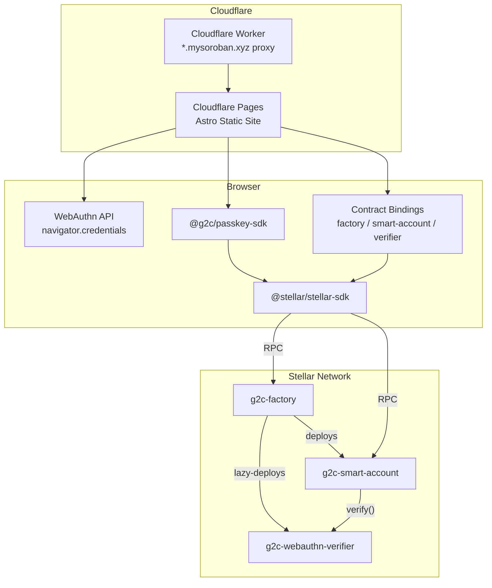
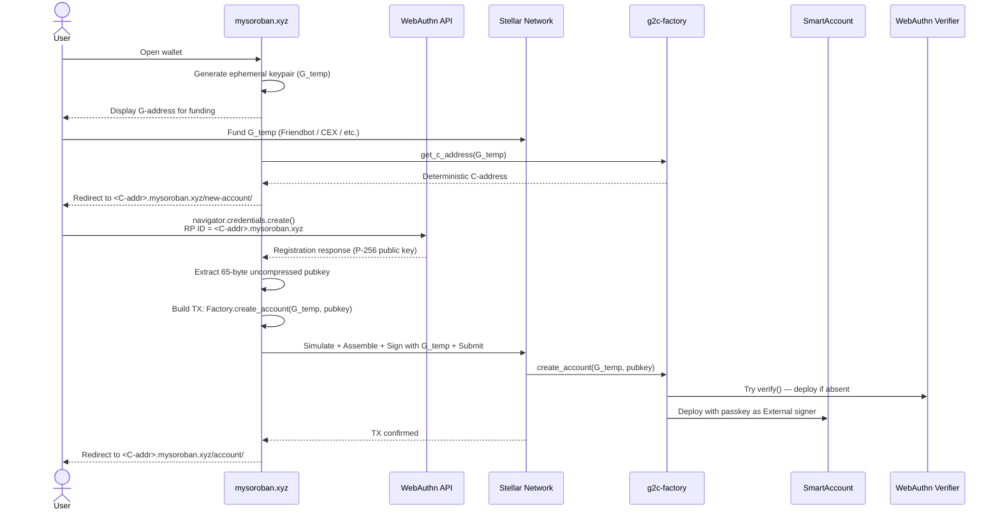
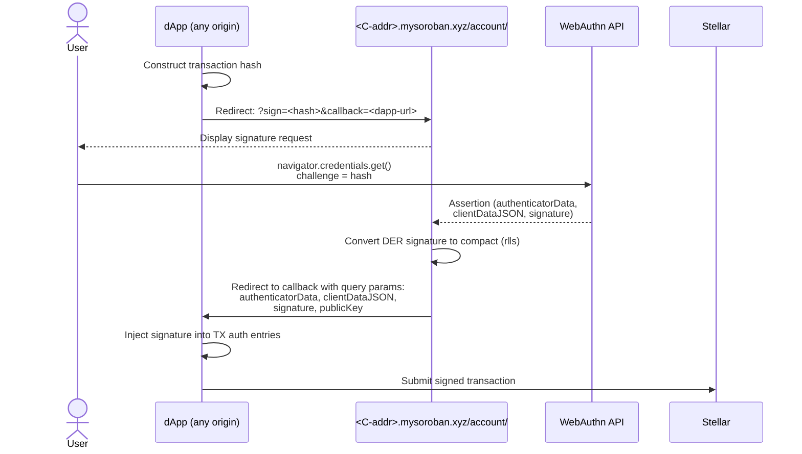
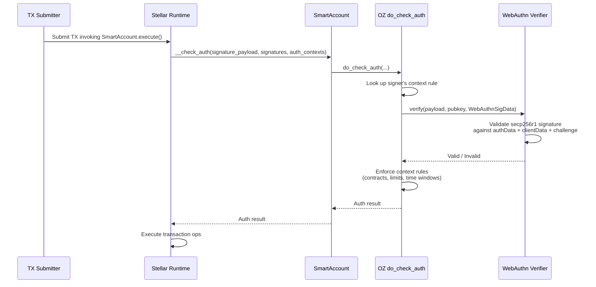
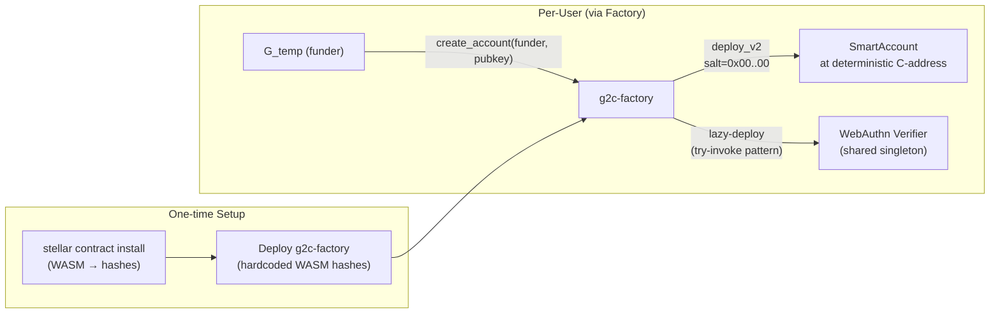

# Technical Architecture

## 1. System Overview

g2c facilitates migration from traditional Stellar accounts ("G-addresses") to Soroban Smart Accounts ("C-addresses") using WebAuthn/passkey authentication. The system consists of three Soroban smart contracts (built on OpenZeppelin's stellar-accounts), a passkey SDK (`@g2c/passkey-sdk`), and an Astro-based web app deployed to Cloudflare Pages with a wildcard subdomain architecture. All passkey verification happens on-chain — there is no off-chain backend.

### High-Level Flow
1. **Onboarding:** User opens wallet → generates ephemeral G-address → funds it → creates passkey → wallet deploys C-address via Factory → funds migrate from G to C.
2. **Signing:** dApp redirects user to their account subdomain with a hash to sign → user approves with passkey → wallet redirects back with signature components.

## 2. Components

### A. Web App (Astro + Cloudflare)

A static Astro site deployed to Cloudflare Pages at `mysoroban.xyz`, using a **subdomain-per-account** pattern where each Smart Account lives at `<contractId>.mysoroban.xyz`. A Cloudflare Worker proxies wildcard subdomain requests to the main site. The frontend extracts the contract ID from the hostname.

All Stellar interaction happens client-side via `@stellar/stellar-sdk`. There are no server-side API routes.

**Pages:**

| Route | Purpose |
|-------|---------|
| `/` | G2C migration entry point. Generates ephemeral G-address keypair, funds via Friendbot (testnet), computes the predicted C-address via `Factory.get_c_address()`, and links to the deployment page. |
| `/new-account/` | Passkey registration + Smart Account deployment. Calls `navigator.credentials.create()` with P-256 (`alg: -7`), RP ID scoped to the subdomain hostname. Builds and submits the `Factory.create_account()` transaction signed by the funder keypair. |
| `/account/` | Account home + signing endpoint. **Home mode:** register passkeys and sign arbitrary hashes. **Signing mode** (via `?sign=<hash>&callback=<url>`): displays signature request, user approves with passkey, redirects back to callback with `authenticatorData`, `clientDataJSON`, `signature`, and `publicKey` as query params. |
| `/dapp/` | Demo dApp page. Generates a random transaction hash, redirects to the target account's `/account/` signing endpoint, and displays the returned signature. |

**Subdomain isolation:** The WebAuthn RP ID is the full hostname (e.g., `CABC123.mysoroban.xyz`), so passkeys are cryptographically scoped per-account at the DNS level. A passkey registered for one account cannot sign for another.

### B. Passkey SDK (`@g2c/passkey-sdk`)

TypeScript SDK (`packages/passkey-sdk/`) providing WebAuthn + Soroban integration utilities. Peer dependency on `@stellar/stellar-sdk`.

| Module | Exports | Purpose |
|--------|---------|---------|
| `webauthn.ts` | `extractPublicKey`, `parseAttestationObject`, `parseRegistration` | Extract 65-byte uncompressed P-256 public key from WebAuthn registration responses. Includes CBOR fallback for mobile/Capacitor. |
| `signature.ts` | `derToCompact` | Convert ASN.1 DER ECDSA signatures to 64-byte compact (r ‖ s) with P-256 low-S normalization (required by Stellar). |
| `auth.ts` | `buildAuthHash`, `getAuthEntry`, `parseAssertionResponse`, `injectPasskeySignature` | Construct Soroban authorization hashes, parse WebAuthn assertion responses, and inject passkey signatures into transaction auth entries. |
| `deploy.ts` | `getContractSalt`, `computeAccountAddress`, `lookupExistingAccount`, `deploySmartAccount` | Compute deterministic C-addresses, check for existing deployments, and execute full deployment flows via the Factory contract. |

### C. Contract Bindings (`packages/contract-bindings/`)

Auto-generated TypeScript clients for each contract (via `stellar contract bindings typescript`). Three sub-packages: `factory`, `smart-account`, `webauthn-verifier`. Expose typed methods and the full OZ smart account type system (context rules, signers, policies, threshold types).

### D. Smart Contracts (Soroban)

All contracts are `#![no_std]` and delegate core logic to OpenZeppelin's `stellar-accounts` library.

| Contract | Source | Description |
|----------|--------|-------------|
| `g2c-factory` | `contracts/factory/` | Deployment orchestrator. `create_account(funder, key)` deploys a SmartAccount with a WebAuthn signer. `get_c_address(funder)` pre-computes the deterministic C-address. Uses `deployer.with_address(funder, salt=0x00..00)` so each funder maps to exactly one C-address. Lazy-deploys a shared WebAuthn verifier via try-invoke pattern (attempts `verify()` on the expected address; deploys if it fails). Hardcoded WASM hashes for deterministic deployment. |
| `g2c-smart-account` | `contracts/smart-account/` | Implements OZ `CustomAccountInterface` + `SmartAccount` + `ExecutionEntryPoint`. Constructor takes `signers` and `policies`, creates a default `ContextRule` with the initial passkey signer. `__check_auth` delegates to `do_check_auth` from stellar-accounts. `execute(target, target_fn, target_args)` provides a generic entry point for arbitrary contract calls. All signer/policy mutations require the account's own auth. |
| `g2c-webauthn-verifier` | `contracts/webauthn-verifier/` | Stateless OZ `Verifier` for secp256r1/P-256 passkey signatures. `KeyData = BytesN<65>` (uncompressed public key), `SigData = WebAuthnSigData` (signature, authenticator_data, client_data). Deploy once, shared across all smart accounts. |

### E. Integration Tests (`crates/integration-tests/`)

Cross-contract integration tests using synthetic P-256 keypairs (`p256::ecdsa::SigningKey::random()`). Test helpers construct full WebAuthn assertions without a browser: base64url-encode the challenge, build minimal authenticatorData (37 bytes), construct clientDataJSON, compute the message digest (`SHA-256(authData || SHA-256(clientData))`), sign with prehash ECDSA, and normalize to low-S. Tests cover verifier correctness, full `__check_auth` flows, and deployment setup validation.

## 3. Data Flows

### Flow 1: Onboarding (G → C Migration)

1. **User** opens the g2c wallet at `mysoroban.xyz`.
2. **Wallet** generates a random Stellar keypair (`G_temp`) and displays the G-address for funding.
3. **User** funds `G_temp` (Friendbot on testnet; CEX withdrawal, another wallet, or fiat on-ramp on mainnet).
4. **Wallet** calls `Factory.get_c_address(G_temp)` to compute the deterministic C-address.
5. **Wallet** links the user to `<C-address>.mysoroban.xyz/new-account/?key=<G_temp_secret>`.
6. **User** creates a passkey via `navigator.credentials.create()` with RP ID = `<C-address>.mysoroban.xyz`.
7. **Wallet** extracts the 65-byte uncompressed P-256 public key from the registration response.
8. **Wallet** constructs a transaction invoking `Factory.create_account(G_temp, pubkey)`:
   - Factory lazy-deploys the shared WebAuthn verifier (if not yet deployed).
   - Factory deploys a new SmartAccount with the passkey as the initial `External` signer.
9. **Wallet** simulates, assembles, signs with `G_temp`, and submits to the Stellar network.
10. **Result:** SmartAccount is live at the deterministic C-address, passkey is the owner. User is redirected to `<C-address>.mysoroban.xyz/account/`.

### Flow 2: dApp Signature Request

The cross-app signing protocol uses URL redirects with query parameters:

1. **dApp** constructs a transaction hash to sign and the callback URL.
2. **dApp** redirects user to `<contractId>.mysoroban.xyz/account/?sign=<hash>&callback=<dapp-url>`.
3. **Wallet** displays the signature request for user review.
4. **User** approves and signs with their passkey (`navigator.credentials.get()` with the hash as challenge).
5. **Wallet** redirects back to the callback URL with query params: `authenticatorData`, `clientDataJSON`, `signature` (compact 64-byte), `publicKey`.
6. **dApp** receives the signature components and can inject them into the transaction's auth entries for submission.

### Flow 3: On-Chain Auth (per transaction)

1. Transaction invoking the SmartAccount's `execute()` is submitted to the network.
2. Stellar runtime calls `SmartAccount.__check_auth()`.
3. SmartAccount delegates to OZ `do_check_auth`, which:
   - Looks up the signer's context rule.
   - Calls `WebAuthnVerifier.verify()` with the signature data and public key.
   - Verifier validates the secp256r1 signature against the authenticatorData + clientDataJSON + challenge.
   - Context rules enforce signer scope (target contracts, spending limits, time windows).
4. Transaction proceeds if all checks pass.

## 4. Deployment & Infrastructure

| Component | Platform | Details |
|-----------|----------|---------|
| Web App | Cloudflare Pages | Static Astro build. Deploy via `just cloudflare-deploy`. |
| Subdomain Proxy | Cloudflare Worker | Route `*.mysoroban.xyz/*` proxied to the Pages site. Enables subdomain-per-account. |
| Contracts | Stellar Testnet | Factory deployed at `CBE3XJK5CLGHPHD46LQSSLHO5R5TIUWBODETEHOLLTMBKK33P3XSJLTZ`. WASM hashes hardcoded in factory. |
| Contract Builds | `just build-contracts` | `stellar contract build --optimize --profile contract` producing wasm32 artifacts. |

## 5. Security Considerations

- **Subdomain Passkey Isolation:** Each account's passkey is bound to its subdomain RP ID (`<contractId>.mysoroban.xyz`), preventing cross-account signature reuse at the WebAuthn protocol level.
- **On-Chain Verification:** All passkey signature verification happens on-chain via the WebAuthn verifier contract. There is no off-chain validation step that could be bypassed.
- **G-Key Ephemerality:** The `G_temp` private key is used only for the deployment transaction and should be discarded afterward. On testnet, the secret is passed via URL query parameter (acceptable for development; must change for mainnet).
- **Passkey Recovery:** SmartAccount supports multiple admin signers via context rules. Users should register a backup device after onboarding.
- **Replay Protection:** SmartAccount nonce tracking (via OZ stellar-accounts) prevents replay. Each WebAuthn assertion challenge is bound to the specific transaction payload.
- **Scoped Sessions:** Context rules can restrict session signers to specific contracts, functions, spending limits, and time windows — enforced on-chain by the SmartAccount.

## 6. Architecture Diagrams

### System Overview

### Flow 1: Onboarding (G → C Migration)

### Flow 2: dApp Signature Request

### Flow 3: On-Chain Auth

### Contract Deployment Architecture

