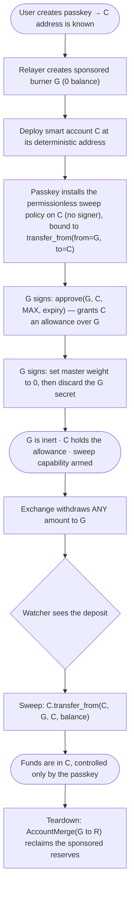
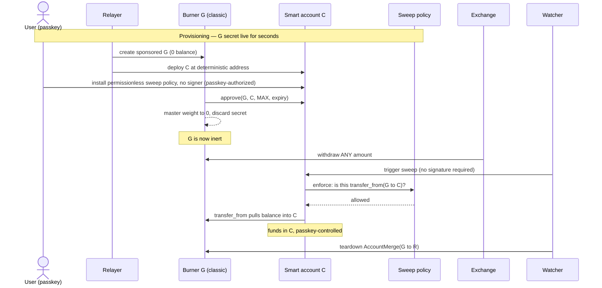
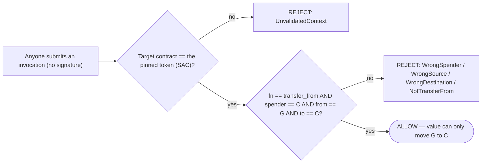

# Onboarding: fund a passkey smart account from a Stellar G-address, non-custodially

## Summary

Let a user end up with funds in a passkey-controlled smart account (**C**, a Soroban contract address) starting from an ordinary Stellar classic account (**G**, the kind an exchange withdraws to), **without any party ever being able to take the funds** and without the user managing a secret key.

The mechanism is an **allowance plus a bounded sweep**:

1. During a short setup step, **C is granted an allowance over G** (`approve`), and G is neutralized so its own key can never spend.
2. Funds are sent to G — any amount, any number of times.
3. **C pulls the funds into itself** with `transfer_from`. The pull is authorized by the user's passkey, or — for a hands-off flow — **permissionlessly by anyone (typically a watcher)**, because the sweep is provably bounded to "move G's balance into C and nothing else" and so needs no key.

From the moment funds arrive on G they are already effectively C's: they sit under C's allowance and no one but C can move them. The only residual risks are liveness (a sweep may be delayed) and reserve reclaim (the relayer's own money) — never user custody.

## Actors and addresses

| Symbol | What it is |
|---|---|
| **G** | A classic Stellar account — the deposit address an exchange or wallet sends to. |
| **C** | The user's passkey smart account (a Soroban contract). Deterministic address, known before deployment. |
| **R** | The relayer: sponsors reserves and pays fees. Can never spend user funds. |
| **watcher** | Submits the permissionless sweep on the user's behalf. Holds no key that can move funds — the passkey or anyone can submit it too. |

## The flow end to end

[In addition to the permissionless sweep policy on C, or as part of it, can we also transfer from G to R? Rationale: sybil-resistence; recover cost of R provisioning G in a CAP-72 world where G is not torn down; help cover costs of R facilitating C's costs over the long-run (maybe this "C pays R for service" thing is even a reasonable way to recover costs or incentivize us to keep running R over the long-run).]

### Phase 1 — Provisioning (G's key is live for a few seconds)

The relayer creates G as a **sponsored account with zero balance** (R covers every reserve, so nothing is stranded later). [BUT: DOSing the Relayer, and with it all Nido wallets, seems really easy! As a human or as a bot/botnet, run Nido's onboarding flow repeatedly, never completing the "fund G" step, until R is drained.] Then, while G's secret exists in relayer memory only:

- **Deploy C** at its deterministic address (authless; R submits and pays).
- **Install the sweep capability on C** — a context rule carrying the sweep policy with **no signer**, bound to `transfer_from(from = G, to = C)`. Authorized by the user's passkey (the account is its own admin). Being signer-free is what makes the later sweep permissionless.
- **G grants the allowance:** `approve(G, C, i128::MAX, expiry)`. Needs no balance; `expiry` is derived from the live network state-archival config (currently ~180 days).
- **G is neutralized:** set master key weight to 0, then discard the secret. G can now do nothing on its own.

### Phase 2 — Funding

The user withdraws from their exchange to G. **Any amount** — there is no pre-committed figure to match, and no memo is required (each G is single-use, so the address alone identifies the deposit). Partial or repeated deposits simply accumulate.

[BUT: what happens if deposits are made to this account after it is discarded?]

### Phase 3 — Sweep

`C.transfer_from(C, G, C, balance)` moves the delivered balance into C. The sweep rule carries no signer, so it is **permissionless** — anyone can submit it, and it can still only move G's balance into C. Two common paths:

- **Passkey sweep:** the user taps their passkey when they return.
- **Hands-off sweep:** a watcher detects the deposit and submits the sweep with **no signature** — no user present, no key to hold. This is what the permissionless policy exists for, and its safety is the subject of the security model below.

Either way the sweep is a normal, retryable transaction, repeatable for any later deposits within the allowance window.

[Is it possible to also add a pre-approved transfer to R (`transfer_from(C, G, R, 10XLM)`) as part of the sweep, to potentially turn R into a profit center rather than a cost center for operators, or to at least offset its costs?]

### Phase 4 — Teardown

When the window closes, `AccountMerge(G → R)` reclaims every reserve R sponsored (a pre-signed, bearer transaction R fee-bumps). G is deleted; zero dust remains. A teardown failure only forfeits R's reserve reclaim — it can never touch user funds.

[After CAP-72 lands and we switch to persistent G accounts, we need to reconsider how to protect R from DOS draining, since at that point R _permanently_ loses the reserve funds (~2XLM?) for every G created. Maybe the "two pre-approved `transfer_from` calls, one to G and one to R, as part of the sweep" idea mentioned above.]

[This system leaves in place the long-term need for R to "facilitate" (stuff & sign the Transaction Envelope for) all transactions from account C. Post CAP-72 with persistent G, can G act as the facilitator for C? (This would not mitigate the risk of R being drained via DOS attack.)]

## Security model

**Claim: no party other than the user's passkey can ever move the user's funds.** This holds through four facts:

1. **A leaked G secret is worthless.** After Phase 1, G's master weight is 0 and its secret is discarded. G can authorize nothing. (For a user-controlled wallet, see Variants — the user keeps their own key, which is theirs anyway.)
2. **Funds are C's the instant they land.** They sit on G under C's allowance; the only account that can move them is C.
3. **The relayer and watcher hold no spending power.** R sponsors and pays fees; it cannot move funds. The watcher only *submits* the sweep — it holds no key, because the sweep needs none.
4. **The sweep is permissionless but bounded to exactly the sweep.** Anyone can invoke it, and it can still only move G's balance into C — so the bound, not a signature, carries the security weight (next section).

### The bounded sweep capability

The permissionless sweep can do **only** `transfer_from(from = the recorded G, to = C)` on the pinned token, and nothing else. Any attempt to redirect funds elsewhere, pull from a different source, spend C's own balance, or call any other function is rejected — no matter who submits it. Since there is no signature gate, the bound is the sole barrier, enforced by two layers an invocation must pass:

- **Layer 1 — contract scope:** the rule is scoped to the single token contract; a call to any other contract is rejected before the policy even runs.
- **Layer 2 — argument check:** a small policy contract reads the `transfer_from` arguments and rejects unless `spender` is C, `from` is the recorded G, and `to` is C.

Because anyone may submit the sweep, these two checks are the entire security perimeter — deliberately so, and validated as such.

This capability is implemented and validated (`PreauthSweepPolicy`, PR #166): the scoping tests run through the real `do_check_auth` path with an **empty signer set** — proving `transfer_from(G → C)` authorizes with zero signatures while every disallowed call rejects with a distinct error code, including a composite test (a diverting context bundled with a valid sweep fails the whole authorization) and a self-source test (C cannot sweep its own funds). Adversarial review: bound airtight, no escape paths.

### Who can do what

| Actor | Can move user funds? | Bounded to | Worst credible failure |
|---|---|---|---|
| Holder of a leaked G secret | **No** | nothing (master weight 0) | learns the G↔C link (disclosure) |
| Relayer R / watcher / anyone | **No** | can only submit the permissionless `transfer_from(G → C)` | stalls the sweep (liveness) — funds stay safe under the allowance |
| Sweep-policy governance admin | **No** | upgrade/rotate the policy | must be a governance key; it holds no ability to move funds |
| The passkey (user) | **Yes** | full control of C | — |

### Preconditions the implementation must guarantee

Because the sweep is permissionless, the argument bound is the sole guarantee — so it must be airtight, and a few properties must hold:

- **The `spender == C`, `from == G`, `to == C`, `fn == transfer_from` checks fail closed on every path** — validated, with no skip or early-return. This is the whole security perimeter, and it is what the audit must scrutinize hardest.
- **The sweep policy's admin is a governance key.** An admin can upgrade the policy; that authority must sit with governance, never exposed to onboarding automation.
- **Set the rule's `valid_until` to the allowance expiry** so a stale sweep rule cannot outlive the window (a provisioning-layer responsibility; the policy does not enforce it). [What are the risks if these mismatch? What is the provisioning layer?]
- **The recorded source G is immutable** once installed (no mutator; changeable only via account-authorized uninstall/reinstall).

### Irreducible trust and bounds

- **G signs twice, once, in a brief live window** (`approve` + neutralize). This is inherent: Stellar classic accounts require the key to authorize any future movement, so the authorization must be set up while the key is live. The relayer holds G's secret only in memory and discards it.
- **The allowance is time-boxed (~180 days).** For the ephemeral flow the secret is gone, so the allowance cannot be renewed; deposits after expiry cannot be claimed. The UX surfaces a countdown and retires the address after teardown.

## Contracts (in scope for the pre-mainnet audit)

This whole flow is new trust surface and must be audited before mainnet. The contract footprint is deliberately tiny:

- **New: `PreauthSweepPolicy`** — a standalone OpenZeppelin `Policy` contract (~120 lines, prototyped and validated). It reads the `transfer_from` arguments in `enforce` and pins `from`/`to`. Independently deployable and upgradable.
- **Unchanged:** the smart-account contract, the factory, the WebAuthn verifier, and the SAC (a protocol contract). The policy plugs into the existing context-rule machinery; **no core-contract changes are required.**

Auditing this alongside the contracts it composes with (one audit, one coherent surface) is the intent — the sweep capability is small and legible, and reviewing it with the account/factory it attaches to is cleaner than a separate later pass.

## Variants (one primitive, three cases)

The same primitive — *C holds an allowance over G, then C pulls* — covers:

- **Exchange / ephemeral burner** (the flow above): the relayer holds G briefly and neutralizes it.
- **One-time transfer:** identical; neutralization optional.
- **User-controlled wallet:** the user's own wallet holds G and signs `approve` (as the transaction source, so any standard wallet works); G is **not** neutralized — it stays the user's account, optionally kept as a recovery signer on C. The user pulls with their passkey (the permissionless sweep policy is only needed for the hands-off ephemeral flow).

[BUT: why do an `approve` or a sweep at all, if I control the G address? If I'm using Freighter (or whatever) to onboard to Nido, I probably don't *want* it to sweep my full G balance. I want to use the Freighter interface to send a specific amount to my new C address.]

## Forward compatibility: CAP-0072

[CAP-0072](https://github.com/stellar/stellar-protocol/blob/master/core/cap-0072.md) ("Contract signers for Stellar accounts", currently Draft) adds a delegated-signer type that lets a classic G-account delegate its authentication to a smart contract's `__check_auth`. When it lands, **G no longer needs to be ephemeral**: set G's master weight to 0 and add a delegated signer = C, and the passkey controls G directly. Moving funds becomes a direct passkey-authorized `transfer(G → C)` — no allowance, no `transfer_from`, no neutralize-and-discard, no 180-day expiry, no per-onboarding teardown. G becomes a persistent, reusable deposit address, and the security model gets cleaner (G is controlled by the same passkey as C).

We are **not** building on it yet (Draft; not on testnet/mainnet). But because it will obsolete the allowance / neutralization / teardown machinery, this design should:

- **Keep a stable seam.** The onboarding interface — "user gets a deposit address G; funds land in C, non-custodially" — is invariant. The funding-source mechanism (allowance + bounded sweep now; delegated signer later) sits behind it as a swappable module.
- **Not over-invest in the ephemeral machinery.** Build the minimum that works on today's protocol.
- **Keep the bounded-sweep policy.** The scoped hands-off sweep is useful in both worlds; its predicate adapts from `transfer_from` to the delegated `transfer(G → C)`. [BUT in a CAP-72 world where C signs for G, do we need the `transfer(G → C)` at all?] 

Migration caveats: exchanges still withdraw to classic G-addresses (G stays the landing zone); a one-time G-key signature is still needed to install the delegated signer; delegated signers cannot authorize classic operations (closing G later routes through the G-account contract to re-add a key, then merge — or G is left open [G-account contract? do you mean "C-account contract"?]); and per CAP-0072 the delegated signer's base reserve cannot be sponsored [BUT it's not?? C is the "delegated signer" for G; G is the one with the base reserve], so a persistent G is an ongoing per-user reserve cost rather than reclaimed at teardown.

## Validation status

- **Sweep capability bound** — implemented and validated (`PreauthSweepPolicy`, PR #166): permissionless (zero-signer) authorization proven on the real `do_check_auth` path; `spender == C` hardening added; composite + self-source attack tests pass; adversarial review found no escape. Remaining: wire the rule's `valid_until` to the allowance expiry, and an on-chain testnet run.
- **Account neutralization + allowance mechanics** — validated on testnet (sponsored 0-balance G, `approve` before funding, `transfer_from` after neutralization, zero-dust teardown).
- **Wiring invariants** — must be enforced and tested at the provisioning layer (not expressible in a contract unit test). [Huh?]

## Milestones

1. **Sweep policy** — ✅ done (PR #166): permissionless `PreauthSweepPolicy` with the `spender == C` hardening and full unit + integration coverage (real `do_check_auth`, zero signers), in the audited contract set. Remaining sub-item: wire the rule's `valid_until` to the allowance expiry.
2. **On-chain validation** — deploy the policy to testnet, wire it onto a factory-deployed C, drive one real permissionless sweep from a neutralized, sponsored G.
3. **Relayer provisioning endpoint** — create sponsored G; deploy C; install the sweep rule; `approve`; neutralize; discard secret; persist state; fee-bump submissions. Enforces the wiring invariants.
4. **Deposit watcher** — detect the deposit on G (Horizon), trigger the bounded sweep, schedule teardown. Holds no key that can move funds anywhere but into C.
5. **Onboarding UX** — passkey creation, deposit address + "send any amount", pending-deposit claim, allowance-expiry countdown, retired-address messaging [Is this "retired-address messaging" our protection against the question I asked earlier, "what happens when user re-sends to torn-down G address"?].
6. **Teardown + reserve reclaim** — scheduled `AccountMerge(G → R)`; bearer escrow of the teardown transaction so reclaim never depends solely on Nido. [What?]
7. **Non-XLM** — per-token allowance + sweep (one sweep rule per token) and a sponsored trustline on G. The policy is already per-token scoped.
8. **Docs + tests** — the security model above, the wiring invariants as enforced checks, and the negative-case scoping tests as an automated lane.

## Acceptance criteria

- [ ] `PreauthSweepPolicy` hardened (`spender == C`, rule expiry) with unit + integration tests, in the audit scope.
- [ ] On-chain hands-off sweep demonstrated on testnet end to end.
- [ ] Provisioning endpoint that installs the signer-free sweep rule with `valid_until` = the allowance expiry, keeps the policy admin a governance key, and never persists G's secret.
- [ ] Watcher that triggers the bounded sweep and cannot move funds outside C.
- [ ] UX for any-amount funding, pending-deposit claim, and expiry.
- [ ] Scheduled teardown with bearer escrow; zero dust.
- [ ] Security model documented; wiring invariants enforced in code; scoping negative-cases in CI.
